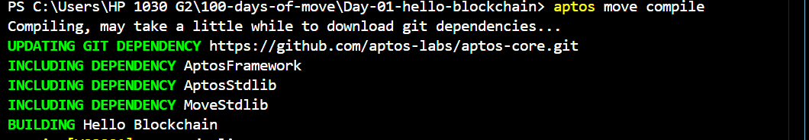

# Hello Blockchain

This project demonstrates a simple "Hello Blockchain" module using the Move programming language on the Aptos blockchain.

## Getting Started

Follow these steps to initialize, compile, test, and deploy the Hello Blockchain module.

### Prerequisites

- Ensure you have either the Aptos CLI or Movement CLI installed. If not, you can install the Aptos CLI from [Aptos CLI Installation Guide](https://aptos.dev/cli-tools/aptos-cli-tool/install-aptos-cli) or the Movement CLI from [Movement CLI Installation Guide](https://docs.movementnetwork.xyz/devs/tutorials/build).

### Initialization

1. Initialize your project by running the following command and choosing the `testnet` network:

    ```sh
    aptos init
    ```

    Or, if using Movement CLI:

    ```sh
    movement init
    ```

    

2. Press `Enter` to activate the default option to create a private key and an account for your contract. Alternatively, you can paste an existing private key.

3. Replace the address in the `Move.toml` file with the newly generated address.

    ```toml
    [addresses]
    blockchain = "0x<your_new_address>"
    ```

### Compilation

4. Compile the Move module using the following command:

    ```sh
    aptos move compile
    ```

    Or, if using Movement CLI:

    ```sh
    movement move compile
    ```

    

### Testing

5. Test the Move module with the following command:

    ```sh
    aptos move test
    ```

    Or, if using Movement CLI:

    ```sh
    movement move test
    ```

    

### Deployment

6. Publish the Move module to the blockchain using the following command:

    ```sh
    aptos move publish
    ```

    Or, if using Movement CLI:

    ```sh
    movement move publish
    ```

    

Congratulations! You have successfully deployed the Hello Blockchain module on the blockchain.