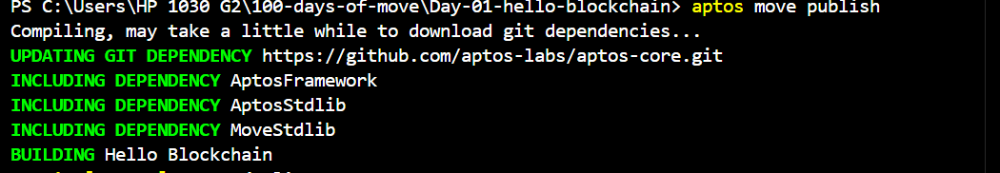

# Move Programming: Book Struct Implementation Guide

## Overview

This guide provides a comprehensive overview of implementing a basic `Book` struct in Move, covering struct definition, creation, and testing. The example demonstrates how to create a custom type with string fields and manipulate struct instances.

## Prerequisites

- Ensure you have either the Aptos CLI or Movement CLI installed. If not, you can install the Aptos CLI from [Aptos CLI Installation Guide](https://aptos.dev/cli-tools/aptos-cli-tool/install-aptos-cli) or the Movement CLI from [Movement CLI Installation Guide](https://docs.movementnetwork.xyz/devs/tutorials/build).

## Struct Implementation

### Required Imports

```move
use std::debug;
use std::string;
use std::string::{utf8};
```

### Book Struct Definition

```move
struct Book has copy, drop, store {
    title: string::String,
    author: string::String
}
```

The `Book` struct has three essential attributes:
- `copy`: Enables struct instances to be copied
- `drop`: Enables struct instances to be discarded
- `store`: Facilitates on-chain storage capability for struct instances

### Constructor Function

```move
public fun new_book(title: string::String, author_name: string::String): Book {
    Book {
        title,
        author: author_name
    }
}
```

This function creates a new `Book` instance with the provided title and author name.

## Testing the Implementation

### Test 1: Creating and Printing Struct Instances

```move
#[test]
public entry fun test_struct_of_structs() {
    let book1 = new_book(utf8(b"Move Programming"), utf8(b"Alice"));
    let book2 = new_book(utf8(b"Blockchain Fundamentals"), utf8(b"Bob"));

    debug::print(&book1);
    debug::print(&book2);
}
```

Expected output:
```
Book { title: "Move Programming", author: "Alice" }
Book { title: "Blockchain Fundamentals", author: "Bob" }
```

### Test 2: Accessing Individual Properties

```move
#[test]
public entry fun test_props_of_struct() {
    let book1 = new_book(utf8(b"Move Programming"), utf8(b"Alice"));
    let book2 = new_book(utf8(b"Blockchain Fundamentals"), utf8(b"Bob"));

    debug::print(&book1.title);
    debug::print(&book1.author);
    debug::print(&book2.title);
    debug::print(&book2.author);
}
```

Expected output:
```
"Move Programming"
"Alice"
"Blockchain Fundamentals"
"Bob"
```

## Complete Module Code

Here's the complete module implementation:

```move
module blockchain::structs {
    use std::debug;
    use std::string;
    use std::string::{utf8};

    struct Book has copy, drop, store {
        title: string::String,
        author: string::String
    }

    public fun new_book(title: string::String, author_name: string::String): Book {
        Book {
            title,
            author: author_name
        }
    }

    #[test]
    public entry fun test_struct_of_structs() {
        let book1 = new_book(utf8(b"Move Programming"), utf8(b"Alice"));
        let book2 = new_book(utf8(b"Blockchain Fundamentals"), utf8(b"Bob"));

        debug::print(&book1);
        debug::print(&book2);
    }

    #[test]
    public entry fun test_props_of_struct() {
        let book1 = new_book(utf8(b"Move Programming"), utf8(b"Alice"));
        let book2 = new_book(utf8(b"Blockchain Fundamentals"), utf8(b"Bob"));

        debug::print(&book1.title);
        debug::print(&book1.author);
        debug::print(&book2.title);
        debug::print(&book2.author);
    }
}
```

## Key Points to Remember

1. **String Handling**
   - Move uses its own `String` type from the `std::string` module
   - Use `utf8(b"string")` to convert byte strings (`b"..."`) to Move strings
   - Strings must be properly imported and handled using the string module

2. **Struct Attributes**
   - `copy`: Enables struct instances to be copied
   - `drop`: Enables struct instances to be discarded
   - `store`: Facilitates on-chain storage capability for struct instances

   We discuss this further in our capability module

3. **Testing**
   - Use `#[test]` attribute for test functions
   - Use `public entry` for functions that can be called directly
   - Use `debug::print()` for debugging output during tests

4. **Field Access**
   - Use dot notation (e.g., `book1.title`) to access struct fields
   - Fields can be accessed for reading when using a reference (`&`)

### Initialization

1. Initialize your project by running the following command and choosing the `testnet` network:

    ```sh
    aptos init
    ```

    Or, if using Movement CLI:

    ```sh
    movement init
    ```

    

2. Press `Enter` to activate the default option to create a private key and an account for your contract. Alternatively, you can paste an existing private key.

3. Replace the address in the `Move.toml` file with the newly generated address.

    ```toml
    [addresses]
    blockchain = "0x<your_new_address>"
    ```

### Compilation

4. Compile the Move module using the following command:

    ```sh
    aptos move compile
    ```

    Or, if using Movement CLI:

    ```sh
    movement move compile
    ```

    

### Testing

5. Test the Move module with the following command:

    ```sh
    aptos move test
    ```

    Or, if using Movement CLI:

    ```sh
    movement move test
    ```

    Here are examples of the `Book` struct printed using `debug::print`:

    
    

### Deployment

6. Publish the Move module to the blockchain using the following command:

    ```sh
    aptos move publish
    ```

    Or, if using Movement CLI:

    ```sh
    movement move publish
    ```

    

This will execute all test functions in the module and display the debug output.

## Common Issues and Solutions

1. **String Conversion**
   - Problem: Cannot directly use string literals
   - Solution: Use `utf8(b"string")` to create Move strings

2. **Struct Attributes**
   - Problem: Compiler errors about missing abilities
   - Solution: Ensure proper attributes (`copy`, `drop`, `store`) are specified

3. **Debug Printing**
   - Problem: Cannot see struct contents
   - Solution: Use `debug::print(&struct)` with a reference to the struct

## Next Steps

1. Add more fields to the `Book` struct (e.g., `publication_year`, `isbn`)
2. Implement getter and setter functions for the fields
3. Add validation logic in the constructor
4. Implement additional functionality like book comparison or sorting

This implementation provides a solid foundation for working with structs in Move. You can extend it based on your specific requirements and use cases.
