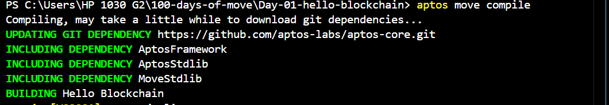

# Move Resource Management: Book Example

This example demonstrates Move's type system capabilities for defining custom types with specific ownership and storage properties. It shows how to create, manage, and interact with a `Book` resource that can be stored on-chain and copied between accounts.

## Key Components

### Book Resource
```move
struct Book has key, store, copy, drop {
    title: string::String,
    author: string::String
}
```

The `Book` struct is defined with four key abilities:
- `key`: Enables the struct to be stored in global storage under an account
- `store`: Allows the struct to be stored in variables and passed between functions
- `copy`: Permits creating duplicates of the Book instance
- `drop`: Allows the Book to be discarded when no longer needed

This differs from traditional Move resources by including `copy` and `drop`, making it more flexible but less restrictive in terms of ownership rules.

### Module Functions

#### 1. Module Initialization
```move
fun init_module(account: &signer)
```
- Automatically called when the module is published
- Creates an initial Book instance with predefined values:
  - Title: "In an harrowed place"
  - Author: "James Spader"
- Publishes the Book to the module publisher's account using `move_to`

#### 2. Book Borrowing (Read-Only)
```move
public fun borrow_book(addr: &address): Book
```
- Returns a copy of the Book stored at the specified address
- Uses `borrow_global` to access the storage
- Returns the entire Book struct rather than a reference
- Will abort if no Book exists at the address

#### 3. Book Borrowing (Mutable)
```move
public fun borrow_book_mut(addr: &address): Book
```
- Similar to `borrow_book`, but uses `borrow_global_mut`
- Returns a copy of the Book, allowing modifications to be made
- Changes to the returned Book won't affect the stored version due to the `copy` ability


### Initialization

1. Initialize your project by running the following command and choosing the `testnet` network:

    ```sh
    aptos init
    ```

    Or, if using Movement CLI:

    ```sh
    movement init
    ```

    

2. Press `Enter` to activate the default option to create a private key and an account for your contract. Alternatively, you can paste an existing private key.

3. Replace the address in the `Move.toml` file with the newly generated address.

    ```toml
    [addresses]
    blockchain = "0x<your_new_address>"
    ```

### Compilation

4. Compile the Move module using the following command:

    ```sh
    aptos move compile
    ```

    Or, if using Movement CLI:

    ```sh
    movement move compile
    ```

    

### Deployment

5. Publish the Move module to the blockchain using the following command:

    ```sh
    aptos move publish
    ```

    Or, if using Movement CLI:

    ```sh
    movement move publish
    ```

    

## Usage Considerations

1. **State Management**: Changes to copied Books will affect the original stored version in when using borrow_global_mut.

3. **Error Handling**: The current implementation will abort if accessing non-existent Books - production code might want to add existence checks.

## Dependencies
- `std::signer`: For account-related operations
- `std::string`: For string handling in the Book struct
