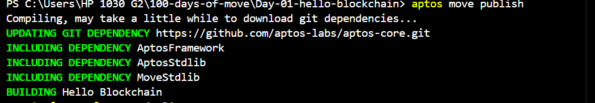

# Move Resource Capabilities and Abilities Guide

## Overview
Move's type system provides fine-grained control over how resources can be used through a system of abilities. 
These abilities determine what operations are permitted on a resource and how it can be stored and managed in the blockchain state.

## Core Abilities

### 1. `drop`
The ability to be discarded or destroyed.
```move
struct DroppableBook has drop {
    author: string::String,
    title: string::String,
}
```
- Allows the resource to be discarded without explicit destruction
- Useful for temporary or intermediate values
- Cannot track resource lifecycle

### 2. `copy`
The ability to be duplicated adn dereferenced
```move
struct CopyableDroppableReadBook has copy, drop {
    value: bool,
}
```
- Enables creating duplicates of the resource
- Allows passing by value without consuming the original
- Typically used with `drop` for maximum flexibility
- Useful for data that doesn't need unique ownership

### 3. `store`
The ability to be stored inside other resources.
```move
struct StorableResource has drop, store {
    balance: u128,
}
```
- Allows the resource to be stored in global storage structs
- Required for nested resources
- Essential for composable data structures
- Cannot independently exist in global storage without `key`

### 4. `key`
The ability to serve as a key in global storage.
```move
struct KeyResource has key {
    identifier: address,
    metadata: StorableResource, // Must have `store` ability
}
```
- Enables use with global storage operations (`move_to`, `borrow_global`)
- Implicitly requires `store` ability for all fields
- Essential for on-chain state management
- Cannot be copied or dropped without explicit handling

## Common Ability Combinations

### Basic Storage (store + drop)
```move
struct StorableResource has drop, store {
    balance: u128,
}
```
- Best for: Resources that need to be stored within other resources but can be discarded
- Use case: Temporary data structures, intermediate calculations

### Full Functionality (copy + drop + store)
```move
struct FullyStorableResource has copy, drop, store {
    name: vector<u8>,
    score: u64,
}
```
- Best for: General-purpose data types
- Use case: Configuration data, parameters, metadata

### Persistent Storage (key + store)
```move
struct KeyResource has key {
    identifier: address,
    metadata: StorableResource,
}
```
- Best for: On-chain state management
- Use case: Account data, persistent game state

## Generic Resources and Ability Inheritance

```move
struct GenericResource<T> has copy, drop, store, key {
    item: T,
}
```

Generic resources can conditionally inherit abilities:
- Abilities are only available if the type parameter supports them
- Enables flexible and reusable resource definitions
- Allows for type-safe composition of abilities

## Best Practices

1. **Minimal Abilities**
   - Only include abilities that are strictly necessary
   - More abilities = less control over resource lifecycle

2. **Ability Composition**
   - Consider how abilities interact
   - `copy` + `drop` for maximum flexibility
   - `key` + `store` for persistent storage

3. **Resource Design**
   - Use `key` sparingly - only for resources that need global storage
   - Include `store` when nesting resources is required
   - Consider `copy` + `drop` for utility types

4. **Safety Considerations**
   - Resources without `drop` must be explicitly handled
   - `key` resources require careful management of global state
   - Generic resources should clearly document ability requirements
### Initialization

1. Initialize your project by running the following command and choosing the `testnet` network:

    ```sh
    aptos init
    ```

    Or, if using Movement CLI:

    ```sh
    movement init
    ```

    

2. Press `Enter` to activate the default option to create a private key and an account for your contract. Alternatively, you can paste an existing private key.

3. Replace the address in the `Move.toml` file with the newly generated address.

    ```toml
    [addresses]
    blockchain = "0x<your_new_address>"
    ```

### Compilation

4. Compile the Move module using the following command:

    ```sh
    aptos move compile
    ```

    Or, if using Movement CLI:

    ```sh
    movement move compile
    ```

    

### Deployment

5. Publish the Move module to the blockchain using the following command:

    ```sh
    aptos move publish
    ```

    Or, if using Movement CLI:

    ```sh
    movement move publish
    ```

    

## Common Use Cases

1. **Temporary Data** (`drop`)
   - Intermediate calculations
   - Local variables
   - Function parameters

2. **Shared Data** (`copy` + `drop`)
   - Configuration values
   - Constants
   - Utility types

3. **Nested Data** (`store` + `drop`)
   - Component parts of larger resources
   - Embedded data structures
   - Modular resource composition

4. **Global State** (`key`)
   - Account information
   - Contract state
   - Persistent data storage
